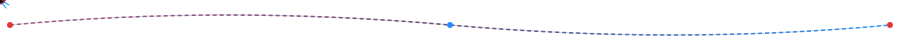

<div align="center">





```text
╔══════════════════════════════════════════════╗
║             SPIDER CODE SYSTEM                ║
╠══════════════════════════════════════════════╣
║  SYSTEM BOOTING...                            ║
║                                                ║
║  WEB CONNECTION      [ ✓ ONLINE ]             ║
║  GITHUB CORE         [ ✓ LINKED ]             ║
║  CODE ENGINE         [ ✓ LOADED ]             ║
║  SPIDER SENSE        [ ✓ ACTIVE ]             ║
║                                                ║
║  PLAYER DETECTED:  NEETESH                    ║
╚══════════════════════════════════════════════╝
```


</div>

<div align="center"></div>

<div align="center">


# 🕷️ SPIDER CODE

### NEETESH
**`SOFTWARE DEVELOPER — FULL STACK (JAVA / SPRING BOOT / REACT)`**

> *"With great code comes great responsibility."*


   


</div>

<div align="center"></div>

## 🔥 SPIDER COMBO — LIVE STREAK METER

<div align="center">


<sub>Live GitHub data — nothing here is hand-typed.</sub>

</div>

<div align="center"></div>

## 🕷️ SPIDER SENSE

<div align="center">


</div>


<table>
<tr><th>⚠️ THREAT DETECTED</th><th>🧠 RESPONSE PROTOCOL</th></tr>

<tr><td>BUG</td><td>DEBUG → breakpoints → console.log</td></tr>

<tr><td>FAILED TEST</td><td>THINK → re-read stack trace → fix</td></tr>

<tr><td>UNSOLVED DSA</td><td>CODE → whiteboard → brute force → optimize</td></tr>

<tr><td>BUILD ERROR</td><td>DEPLOY → clean → rebuild → check deps</td></tr>

</table>

<div align="center"></div>

## 🎯 SPIDER MISSIONS


| STATUS | SIDE MISSION | REWARD |
|:---:|---|:---:|

| ⬜ | Master DSA |  |

| ⬜ | Ship Spring Boot projects |  |

| ⬜ | Level up competitive programming |  |

| ⬜ | Learn system design |  |

| ⬜ | Contribute to open source |  |

| ⬜ | Deploy real applications |  |


<sub>XP values are a personal gamification system, not an official metric.</sub>


<div align="center"></div>

## ⚔️ COMBO CHAINS


```text
JAVA → SPRING BOOT → DATABASE → REST API
```


```text
DSA → LEETCODE → CONTEST → CODECHEF
```


```text
HTML → CSS → JAVASCRIPT → REACT
```


<div align="center"></div>

## 🕷️ SUIT UPGRADES — SKILL TREE


```text
                        🕷️ SPIDER CODE
                              │
        ┌─────────────────────┼─────────────────────┐
        │                     │                     │
    FRONTEND              BACKEND                  DSA
        │                     │                     │
   HTML/CSS/JS          JAVA/SPRING          ARRAYS/STRINGS
     REACT               BOOT/MYSQL          TREES/GRAPHS/DP
```


<div align="center">


<br>

<br>

<br>

<br>

<br>


</div>

<div align="center"></div>

## 🎒 SUIT ARSENAL


<table>
<tr><th>TECH</th><th>ABILITY</th></tr>

<tr><td>Java</td><td>Backend Power</td></tr>

<tr><td>Spring Boot</td><td>Web Engine</td></tr>

<tr><td>JavaScript</td><td>Web Control</td></tr>

<tr><td>React</td><td>UI Reflex System</td></tr>

<tr><td>DSA</td><td>Spider Sense</td></tr>

<tr><td>MySQL</td><td>Data Vault</td></tr>

<tr><td>Git</td><td>Time-Rewind Module</td></tr>

<tr><td>GitHub</td><td>Web Network</td></tr>

</table>


<div align="center">


</div>

<div align="center"></div>

## 🏆 SPIDER ACHIEVEMENTS


<table>
<tr><th>BADGE</th><th>ACHIEVEMENT</th><th>STATUS</th></tr>

<tr><td>🕷️ FIRST WEB</td><td>First GitHub repository</td><td></td></tr>

<tr><td>🔥 STREAK MASTER</td><td>Maintain a coding streak</td><td></td></tr>

<tr><td>⚔️ CODE WARRIOR</td><td>Solve 100+ DSA problems</td><td></td></tr>

<tr><td>🚀 PROJECT LAUNCH</td><td>Deploy a real project</td><td></td></tr>

<tr><td>🌐 OPEN SOURCE ALLY</td><td>Contribute to open source</td><td></td></tr>

<tr><td>🏗️ ARCHITECT</td><td>Design a system from scratch</td><td></td></tr>

</table>


<sub>Replace UNLOCKED/LOCKED based on what you've actually achieved.</sub>


<div align="center"></div>

## 🧩 SPIDER BATTLE ARENA — LEETCODE

<div align="center">


</div>

<div align="center"></div>

## ⚔️ CODING COMBAT ARENA — CODECHEF


<table align="center">
<tr><th>RATING</th><th>STARS</th><th>CONTESTS</th><th>PROBLEMS</th></tr>

<tr><td>[YOUR_RATING]</td><td>[YOUR_STARS]</td><td>[YOUR_CONTEST_COUNT]</td><td>[YOUR_SOLVED_COUNT]</td></tr>
</table>


<sub>No reliable auto-fetch API exists for CodeChef — fill in your real numbers.</sub>


<div align="center"></div>

## 🐍 WEB HUNTER — CONTRIBUTION SNAKE

<div align="center">


</div>

<div align="center"></div>

## 🕸️ WEB OF CONTRIBUTIONS

<div align="center">


</div>

<div align="center"></div>

## 📊 SPIDER HUD STATS

<div align="center">


</div>

<div align="center"></div>

## 🕶️ SECRET IDENTITY


```text
$ whoami
> Neetesh

$ role
> Software Developer (Full-Stack — Java / Spring Boot / React)

$ location
> India

$ mission
> BUILDING...

$ status
> ONLINE 🟢
```


<div align="center"></div>

## 👾 CURRENT BOSS

<div align="center">


 


**DEFEAT CONDITION:** Keep showing up.

</div>

<div align="center"></div>

## 🕷️ STORY MISSIONS — PROJECTS


```text
╔══════════════════════════════════════════════╗
║ 🕷️ MISSION 01
║ CODESYNC
║
║ TECH: TS + Spring Boot + PostgreSQL
║ Auto-tracks LeetCode/CodeChef subs, syncs to GitHub.
║
║ REPO: github.com/nodeneetesh/codesync
╚══════════════════════════════════════════════╝
```
 


```text
╔══════════════════════════════════════════════╗
║ 🕷️ MISSION 02
║ URL SHORTENER
║
║ TECH: Java / Spring Boot / JWT
║ Full-stack shortener with auth + tracking.
║
║ REPO: github.com/nodeneetesh/url-shortener
╚══════════════════════════════════════════════╝
```
 


```text
╔══════════════════════════════════════════════╗
║ 🕷️ MISSION 03
║ STUDYFLOW
║
║ TECH: HTML / CSS / JS (offline)
║ Offline single-file student planner app.
║
║ REPO: github.com/nodeneetesh/studyflow
╚══════════════════════════════════════════════╝
```
 


```text
╔══════════════════════════════════════════════╗
║ 🕷️ MISSION 04
║ PDF HIGHLIGHTER
║
║ TECH: Electron / PDF.js
║ Offline desktop PDF annotation app.
║
║ REPO: github.com/nodeneetesh/pdf-highlighter
╚══════════════════════════════════════════════╝
```
 


<div align="center"></div>

## ⚡ SPIDER LEVEL

<div align="center">


<sub>Fictional personal gamification system.</sub>

</div>

<div align="center"></div>

## 🕸️ SPIDER NETWORK

<div align="center">


[](https://github.com/nodeneetesh)

[](https://www.linkedin.com/in/neetesh--kumar/)

[](mailto:Nodeneetesh@gmail.com)


</div>

<div align="center"></div>

<div align="center">


```text
SPIDER CODE

MISSION STATUS:  IN PROGRESS...
NEXT MISSION:    BUILD SOMETHING GREAT.
PLAYER STATUS:   ONLINE
```


</div>
